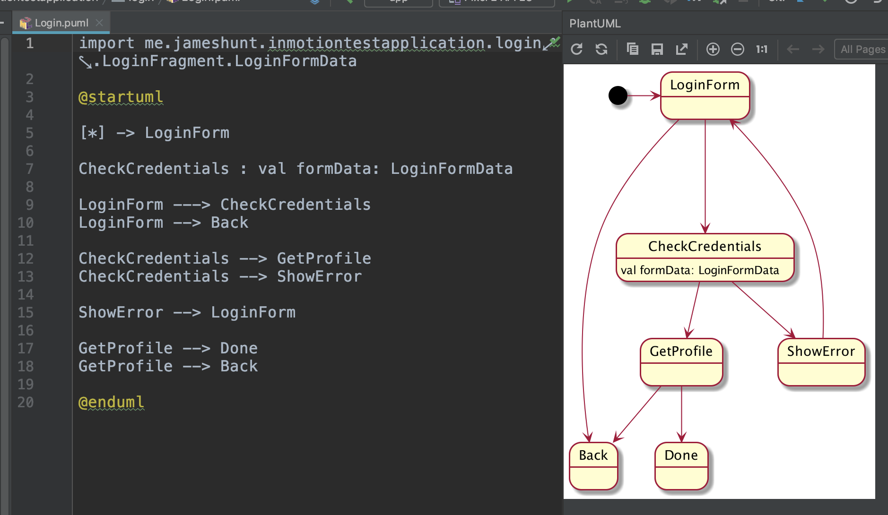
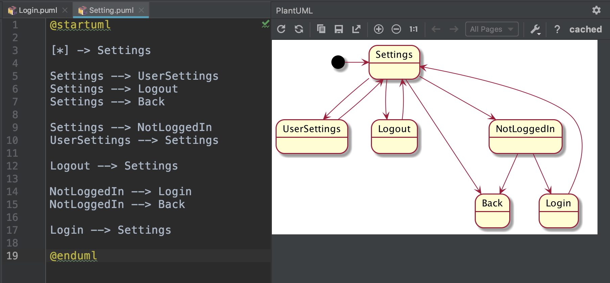
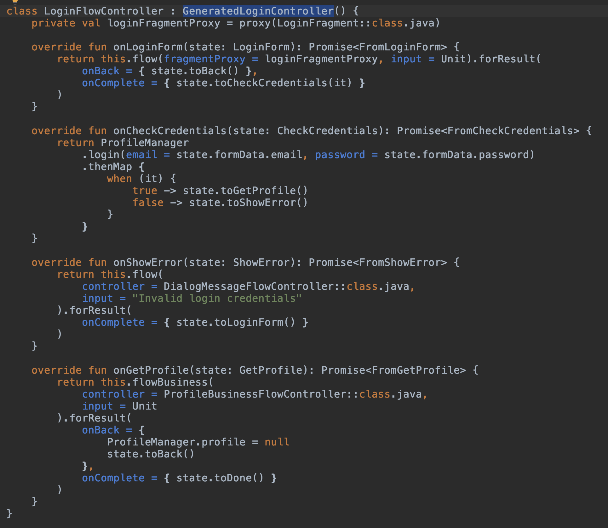

# Composable, compile time verified state machines - Flow

Generated code enables compile time verification.

Composability: From one state machine you can launch another child state machine that will eventually return its result back to the parent, at which point the parent can resume.

Includes a unit testing framework, and an optional android specific module.

Code generator: https://github.com/huntj88/FlowGenerate

Sample app and usage: https://github.com/huntj88/FlowSampleApp

State machine code is generated from Puml files

Generated code provides the transition methods so that invalid transitions cannot even be attempted, and that the correct data is passed in for the transition to be valid

